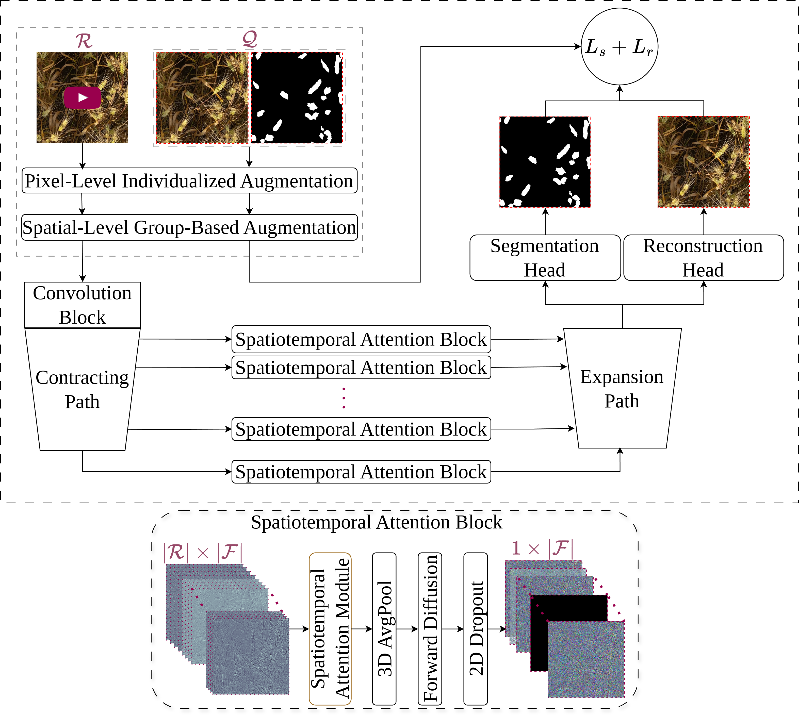
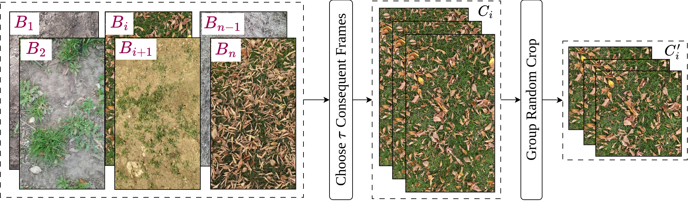
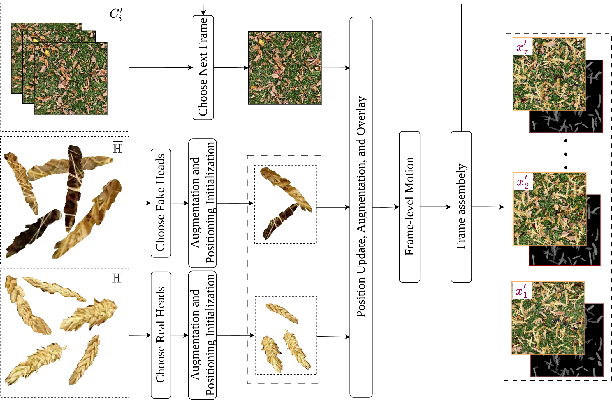

# A Semi-Self-Supervised Approach for Dense-Pattern Video Object Segmentation
---

## Overview

This repository contains the official implementation for the paper [A Semi-Self-Supervised Approach for Dense-Pattern Video Object Segmentation](https://openaccess.thecvf.com/content/CVPR2025W/V4A/papers/Najafian_A_Semi-Self-Supervised_Approach_for_Dense-Pattern_Video_Object_Segmentation_CVPRW_2025_paper.pdf). We tackle the challenging task of Dense Video Object Segmentation (DVOS) in agricultural settings, particularly wheat head segmentation, where objects are numerous, small, occluded, and move unpredictably. Our approach uses a semi-self-supervised method leveraging synthetic data and pseudo-labels, significantly reducing the need for costly manual video annotations. The core of our method is a multi-task UNet-style architecture enhanced with diffusion and spatiotemporal attention mechanisms.

<div style="text-align: justify;">
  
  <p><em>Figure 1: The proposed UNet-style architecture, highlighting the multi-task heads (segmentation, reconstruction) and the spatiotemporal attention blocks with diffusion integration.</em></p>
</div>

---

## Setup

### Clone Repository
```bash
git clone https://github.com/KeyhanNajafian/DVOS.git
cd DVOS
```

### Create Environment
We recommend using Conda:
```bash
conda env create -f environment.yaml
conda activate DVOSEnv
```
Alternatively, use pip:
```bash
pip install -r requirements.txt
```

---

## Video Synthesis

This repository is primarily driven by YAML configuration files:

- **Frame and Object Extraction:** Config files are located in `extraction/configs/`
- **Video Synthesis:** Config files are located in `simulation/configs/`

**Note**: The sample CSV files can be found in the `data/` directory. 

<div style="text-align: justify;">
  
  <p><em>Figure 2: The procedure for extracting video frames from background videos </em></p>
</div>

<div style="text-align: justify;">
  
  <p><em>Figure 3: This diagram illustrates the process of synthesizing videos.</em></p>
</div>

You can use the following scripts in the extraction module along with their corresponding config files to extract video frames and objects:
```bash
python frames_extractor.py --config configs/frames_extractor.yaml

python objects_extractor.yaml --config configs/objects_extractor.yaml
```
The extracted frames and objects will be organized into CSV files and can be used for data synthesis. To do this, modify the config file `simulation/configs/simulation_pipeline.yaml` and run the following command in the simulation module:

```bash
python simulator.py --config configs/simulator.yaml
```
This will automatically generate the corresponding metadata, organized into CSV files, which can be directly used for model training with DVOSCode.

---

## Usage
### Pretrained Weights
Pretrained model weights are available at [this link](https://drive.google.com/file/d/10Sztp_8fzEDx7lsa1ilr5Er4G3l_pmWK/view?usp=sharing).

### Data Organization
- **DVOSCode Pipeline**:  
  For this pipeline, the frames and masks are stored in CSV files. You can find the CSV metadata inside the `data/` folder, which contains all the necessary references for the frames and masks.

- **DVOSXMem Pipeline**:  
  For this pipeline, you need to organize your data in a `root folder` with two subfolders: `frames/` and `masks`. Inside these subfolders, create identical short video clip subfolders, each containing the corresponding frames and masks for each video.


### Training
**Training DVOS model**
Set the config file properly from the DVOSCode pipeline.  
```bash
python3 ddp_experiment.py --config configs/configs.yaml
```
**Note**: Example CSV files required for simulation and training are included in the data directory for reference.

**Training XMem model**
To train the XMem model, run the following command inside the XMemCode pipeline:

```bash
torchrun --master_port 25763 --nproc_per_node=2 train.py \
  --stage 2 \
  --s2_batch_size 16 \
  --s2_iterations 30000 \
  --s2_finetune 10000 \
  --s2_lr 0.0001 \
  --s2_num_ref_frames 4 \
  --save_network_interval 5000 \
  --load_network model_path.pth \ 
  --wheat_root data_root_dir_path \ 
  --exp_id experiment_name
  ```
**Note**: The XMem pipeline used in this project is a slightly modified version of the original [XMem repository](https://github.com/hkchengrex/XMem). You can still access the original version at the provided link.

### Evaluation
**Evaluating DVOSXMem**
To run the evaluation, make sure to:

1. Set the configuration file to the `TEST` phase.
2. Specify the path to the best-pretrained model you want to evaluate.

```bash
python3 ddp_experiment.py --config configs/configs.yaml
```

**Evaluating DVOSXMem**
To evaluate a trained DVOSXMem model on a test dataset, run the following command:

```bash
python eval.py \
  --model best_model_path.pth \
  --dataset test_set_root_dir_path \
  --split test \
  --size 384 \
  --output prediction_dir_path
```

This will generate the predicted masks and save them inside the prediction_dir_path folder.

Next, run the following command to calculate the scores and overlay the predictions onto the samples in the test set, using the specified overlay_interval:

```bash
python scoring.py --gt_dir base_test_root_dir --pr_dir prediction_dir_path --overlay_interval 1
```

---
## Citation
```bibtex
@inproceedings{najafian2025semi,
  title     = {A Semi-Self-Supervised Approach for Dense-Pattern Video Object Segmentation},
  author    = {Najafian, Keyhan and Maleki, Farhad and Jin, Lingling and Stavness, Ian},
  booktitle = {Proceedings of the Computer Vision and Pattern Recognition (CVPR) Conference},
  pages     = {5412--5421},
  year      = {2025}
}
```
